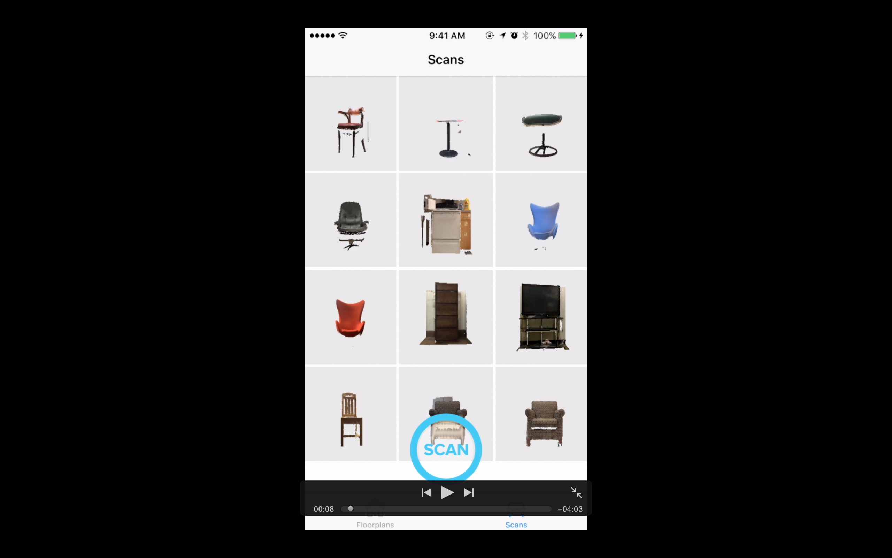

# Hom3Design
An interior design based application for crowdsourcing 3D models of furniture

To run this code, you will need to download the [Structure framework](https://developer.structure.io/sdk), [OpenCV framework for iOS](http://opencv.org/downloads.html) and the [Amazon Web Services framework for iOS](https://aws.amazon.com/mobile/sdk/) and add them to the Xcode project.

